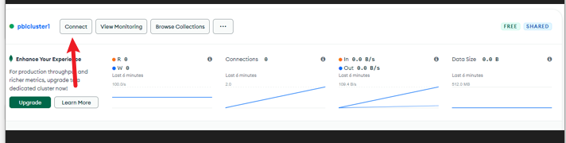
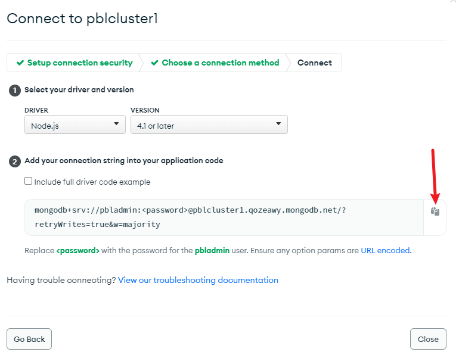

# SIMPLE TO-DO APPLICATION ON MERN WEB STACK

MERN STACK CONSIST OF THE FOLLOWING COMPONENTS AND WE WILL BE WORKING WITH ALL OF THEM. AWESOME! 
 - MongoDB
 - ExpressJS
 - ReactJS
 - NodeJS

 # Backend Configuration
To start every project, it is recommended to always update/upgrade your linux server to recieve latest packages
To do this, run the commands below and follow the prompts

    `sudo apt update`
    `sudo apt upgrade`

To install Node.js, we fetch it's location from Ubuntu repositories

    `curl -fsSL https://deb.nodesource.com/setup_18.x | sudo -E bash -`

Install Node.js with the command below

    `sudo apt-get install -y nodejs

Check that node.js is installed with

    `node -v`
    `npm -v`

Create a directory for the project

    `mkdir Todo`

Change directory into Todo and initialize the project directory using command and follow the prompt to add some custom info to your project as you prefer. To use default value, click through the promts

    `npm init`


# INSTALL EXPRESSJS

To install express, run the command

    `npm install express`

Also install dontenv module

    `npm install dotenv`

Create and edit index.js file using vim

    `vim index.js`

Copy the following code into index.js

    ```
    const express = require('express');
    require('dotenv').config();
    
    const app = express();
    
    const port = process.env.PORT || 5000;
    
    app.use((req, res, next) => {
    res.header("Access-Control-Allow-Origin", "\*");
    res.header("Access-Control-Allow-Headers", "Origin, X-Requested-With, Content-Type, Accept");
    next();
    });
    
    app.use((req, res, next) => {
    res.send('Welcome to Express');
    });
    
    app.listen(port, () => {
    console.log(`Server running on port ${port}`)
    });
    ```

> **Note** we have specified to use port 5000 in the code which will be required later when we go on the browser.

Now, we test our server to ensure all works well. Run below command

    `node index.js`

If all is as expected, result is shown below


NB: Ensure to add an inbound that allows port 5000 on your server


Open up your browser and try to access your server’s Public IP or Public DNS name followed by port 5000

    `http://<PublicIP-or-PublicDNS>:5000`


### Routes
There are three actions that our To-Do application needs to be able to do:
    1. Create a new task
    2. Display list of all tasks
    3. Delete a completed task

For each task, we need to create routes that will define various endpoints that the To-do app will depend on. So let us create a folder routes

    `mkdir routes`

Create and edit api.js file with the script below

    ```
    const express = require ('express');
    const router = express.Router();
    
    router.get('/todos', (req, res, next) => {
    
    });
    
    router.post('/todos', (req, res, next) => {
    
    });
    
    router.delete('/todos/:id', (req, res, next) => {
    
    })
    
    module.exports = router;
    ```
Next, we create Models directory.

# MODELS
To use MongoDB, we create a model which is the heart of JavaScript based applications, and it is what makes it interactive.

To create a Schema and a model, install mongoose which is a Node.js package that makes working with mongodb easier.

Change directory back Todo folder and install Mongoose

    `npm install mongoose`

Create a new folder models change directory into it and create todo.js file

    `mkdir models && cd models && touch todo.js`

Edit todo.js with script below

    ```
    const mongoose = require('mongoose');
    const Schema = mongoose.Schema;
    
    //create schema for todo
    const TodoSchema = new Schema({
    action: {
    type: String,
    required: [true, 'The todo text field is required']
    }
    })
    
    //create model for todo
    const Todo = mongoose.model('todo', TodoSchema);
    
    module.exports = Todo;
    ```

Also replace comtent in Todo/routes/api.js with 

    ```
    const express = require ('express');
    const router = express.Router();
    const Todo = require('../models/todo');
    
    router.get('/todos', (req, res, next) => {
    
    //this will return all the data, exposing only the id and action field to the client
    Todo.find({}, 'action')
    .then(data => res.json(data))
    .catch(next)
    });
    
    router.post('/todos', (req, res, next) => {
    if(req.body.action){
    Todo.create(req.body)
    .then(data => res.json(data))
    .catch(next)
    }else {
    res.json({
    error: "The input field is empty"
    })
    }
    });
    
    router.delete('/todos/:id', (req, res, next) => {
    Todo.findOneAndDelete({"_id": req.params.id})
    .then(data => res.json(data))
    .catch(next)
    })
    
    module.exports = router;
    ```

The next piece of our application will be the MongoDB Database

# MONGODB DATABASE
We need a database where we will store our data, in this project we use the Atlas mLab which offers DBaaS and has a free shared cluster account good enough for us.

Sign up for a free account [here](https://www.mongodb.com/atlas-signup-from-mlab) and select AWS as the cloud provider. Also choose a region near you to complete sign up.


Complete a get started checklist as shown in the images below

1. Create Cluster


2. Create database user


3. Allow connectivity from anywhere


4. Create DB


create .env in TOdo folder with the command below

    `DB = 'mongodb+srv://<username>:<password>@<network-address>/<dbname>?retryWrites=true&w=majority'`

> **Note**
    replace <username> with db username
    replace <password> with user password
    replace <network-address> with connection URL 
    replcae <dbname> with database name

Here is how to get the connection string





Here, replace content in index.js with

    ```const express = require('express');
    const bodyParser = require('body-parser');
    const mongoose = require('mongoose');
    const routes = require('./routes/api');
    const path = require('path');
    require('dotenv').config();
    
    const app = express();
    
    const port = process.env.PORT || 5000;
    
    //connect to the database
    mongoose.connect(process.env.DB, { useNewUrlParser: true, useUnifiedTopology: true })
    .then(() => console.log(`Database connected successfully`))
    .catch(err => console.log(err));
    
    //since mongoose promise is depreciated, we overide it with node's promise
    mongoose.Promise = global.Promise;
    
    app.use((req, res, next) => {
    res.header("Access-Control-Allow-Origin", "\*");
    res.header("Access-Control-Allow-Headers", "Origin, X-Requested-With, Content-Type, Accept");
    next();
    });
    
    app.use(bodyParser.json());
    
    app.use('/api', routes);
    
    app.use((err, req, res, next) => {
    console.log(err);
    next();
    });
    
    app.listen(port, () => {
    console.log(`Server running on port ${port}`)
    });
    ```

Start your server using the command:

    `node index.js`


During development, we will need a way to test our code using RESTfulL API. In this project we'll be using Postman as a API development client to test our code.

Open your Postman, create a POST request to the API

    `http://<PublicIP-or-PublicDNS>:5000/api/todos`


We have successfully created our Backend, we now proceed to create the Frontend.

# FRONTEND CREATION

To start out with the frontend of the To-do app, we will use the create-react-app command to scaffold our app.
In the same root directory as your backend code, which is the Todo directory, run:

    ` npx create-react-app client`

Before testing the react app, there are some dependencies that need to be installed.

- Concurrently

    `npm install concurrently --save-dev`

- nodemon

    `npm install nodemon --save-dev`

- In Todo folder open the package.json file, change the script key/value content to 

    ```
    "scripts": {
    "start": "node index.js",
    "start-watch": "nodemon index.js",
    "dev": "concurrently \"npm run start-watch\" \"cd client && npm start\""
    },
    ```

Also add  key value pair "proxy": "http://localhost:5000" to the file

Now, ensure you are inside the Todo directory, run

    `npm run dev`


> **Note** To access the application from the Internet ensure to open TCP port 3000 on the server

## Creating your React Components
From Todo directory 

    `cd client\src`
    `mkdir components && cd components && touch Input.js ListTodo.js Todo.js`

Edit the javascript files as demonstrated below
    `vim Input.js`
    ```
    import React, { Component } from 'react';
    import axios from 'axios';
    
    class Input extends Component {
    
    state = {
    action: ""
    }
    
    addTodo = () => {
    const task = {action: this.state.action}
    
        if(task.action && task.action.length > 0){
        axios.post('/api/todos', task)
            .then(res => {
            if(res.data){
                this.props.getTodos();
                this.setState({action: ""})
            }
            })
            .catch(err => console.log(err))
        }else {
        console.log('input field required')
        }
    
    }
    
    handleChange = (e) => {
    this.setState({
    action: e.target.value
    })
    }
    
    render() {
    let { action } = this.state;
    return (
    <div>
    <input type="text" onChange={this.handleChange} value={action} />
    <button onClick={this.addTodo}>add todo</button>
    </div>
    )
    }
    }
    
    export default Input
    ```
Go back to client folder, Install Axios which is a Promise based HTTP client for the browser and node.js in clients directory

    `npm install axios`

In src/components directory

Edit ListTodo.js

    ```
    import React from 'react';
    
    const ListTodo = ({ todos, deleteTodo }) => {
    
    return (
    <ul>
    {
    todos &&
    todos.length > 0 ?
    (
    todos.map(todo => {
    return (
    <li key={todo._id} onClick={() => deleteTodo(todo._id)}>{todo.action}</li>
    )
    })
    )
    :
    (
    <li>No todo(s) left</li>
    )
    }
    </ul>
    )
    }
    
    export default ListTodo
    ```

Edit Todo.js

    ```
    import React, {Component} from 'react';
    import axios from 'axios';
    
    import Input from './Input';
    import ListTodo from './ListTodo';
    
    class Todo extends Component {
    
    state = {
    todos: []
    }
    
    componentDidMount(){
    this.getTodos();
    }
    
    getTodos = () => {
    axios.get('/api/todos')
    .then(res => {
    if(res.data){
    this.setState({
    todos: res.data
    })
    }
    })
    .catch(err => console.log(err))
    }
    
    deleteTodo = (id) => {
    
        axios.delete(`/api/todos/${id}`)
        .then(res => {
            if(res.data){
            this.getTodos()
            }
        })
        .catch(err => console.log(err))
    
    }
    
    render() {
    let { todos } = this.state;
    
        return(
        <div>
            <h1>My Todo(s)</h1>
            <Input getTodos={this.getTodos}/>
            <ListTodo todos={todos} deleteTodo={this.deleteTodo}/>
        </div>
        )
    
    }
    }
    
    export default Todo;
    ```

Return to client folder, edit App.js by copying these into it

import React from 'react';
 
    ```import Todo from './components/Todo';
    import './App.css';
    
    const App = () => {
    return (
    <div className="App">
    <Todo />
    </div>
    );
    }
    
    export default App;
    ```

In the src directory open the App.css, Then paste the following code into App.css:

    ```
    .App {
    text-align: center;
    font-size: calc(10px + 2vmin);
    width: 60%;
    margin-left: auto;
    margin-right: auto;
    }
    
    input {
    height: 40px;
    width: 50%;
    border: none;
    border-bottom: 2px #101113 solid;
    background: none;
    font-size: 1.5rem;
    color: #787a80;
    }
    
    input:focus {
    outline: none;
    }
    
    button {
    width: 25%;
    height: 45px;
    border: none;
    margin-left: 10px;
    font-size: 25px;
    background: #101113;
    border-radius: 5px;
    color: #787a80;
    cursor: pointer;
    }
    
    button:focus {
    outline: none;
    }
    
    ul {
    list-style: none;
    text-align: left;
    padding: 15px;
    background: #171a1f;
    border-radius: 5px;
    }
    
    li {
    padding: 15px;
    font-size: 1.5rem;
    margin-bottom: 15px;
    background: #282c34;
    border-radius: 5px;
    overflow-wrap: break-word;
    cursor: pointer;
    }
    
    @media only screen and (min-width: 300px) {
    .App {
    width: 80%;
    }
    
    input {
    width: 100%
    }
    
    button {
    width: 100%;
    margin-top: 15px;
    margin-left: 0;
    }
    }
    
    @media only screen and (min-width: 640px) {
    .App {
    width: 60%;
    }
    
    input {
    width: 50%;
    }
    
    button {
    width: 30%;
    margin-left: 10px;
    margin-top: 0;
    }
    }
    ```

In the src directory open the index.css

    `vim index.css`

Copy and paste the code below:

body {
margin: 0;
padding: 0;
font-family: -apple-system, BlinkMacSystemFont, "Segoe UI", "Roboto", "Oxygen",
"Ubuntu", "Cantarell", "Fira Sans", "Droid Sans", "Helvetica Neue",
sans-serif;
-webkit-font-smoothing: antialiased;
-moz-osx-font-smoothing: grayscale;
box-sizing: border-box;
background-color: #282c34;
color: #787a80;
}
 
code {
font-family: source-code-pro, Menlo, Monaco, Consolas, "Courier New",
monospace;
}

Go to the Todo directory and run

    `npm run dev`